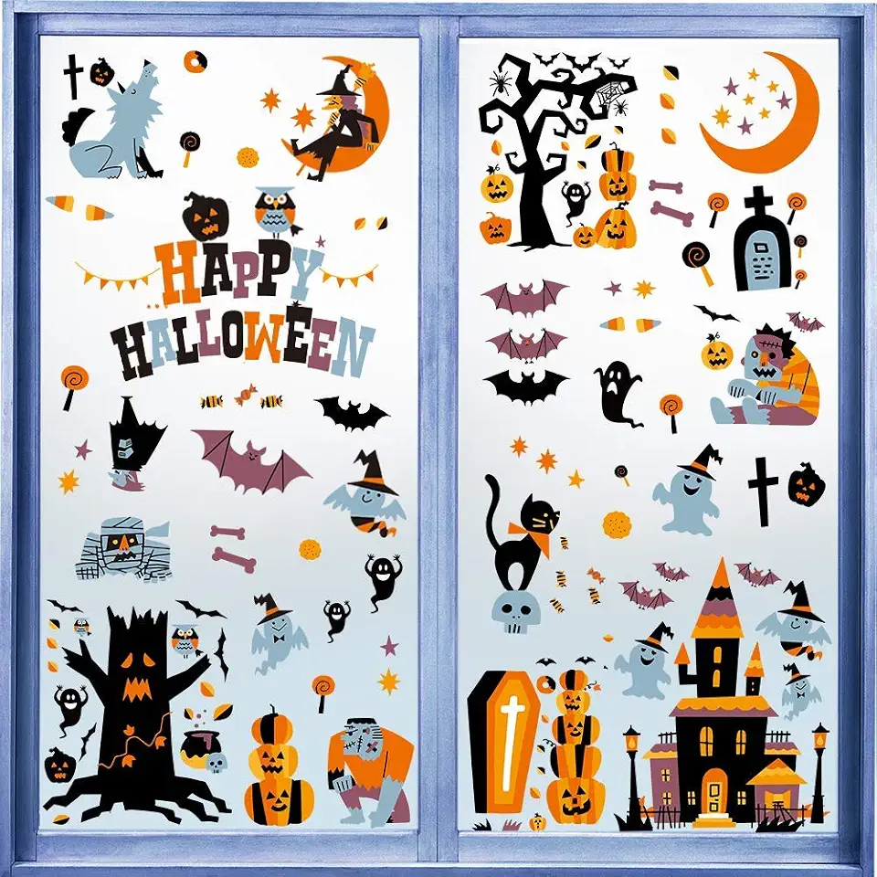

# 窗贴项目总结

## 1. 项目输入输出

项目将一张电商场景原图，转换为可供人工比较与选择的窗贴排版候选。

| 输入 · 电商原图 | 期望 · 目标效果示意图 | 输出 · 窗贴排版候选 |
| :---: | :---: | :---: |
|  |  |  |

> 示例取自历史任务 `20260729-193043-06645399`。中间图是人工拼出的目标效果，用于表达期望的构图与元素分布；右侧是系统最终选中的 `candidate-4`。

### 输入输出示例二 · 网格切片

这种方式先把完整平面图案按 `2 × 3` 网格切开，再输出为 6 张可分别打印、最后重新拼合的切片。

| 效果参考 · 上窗后的样子 | 输入 · 完整平面图案 | 输出 · PDF 第 1 页切片总览 |
| :---: | :---: | :---: |
|  |  |  |

> **怎么看第 1 页：**红色切线把完整图案分成左右两列、上下三行；后续 6 页依次对应这六个区域。

#### 六张独立切片页

| 左上 · 第 1 块 | 右上 · 第 2 块 | 左中 · 第 3 块 |
| :---: | :---: | :---: |
|  |  |  |

| 右中 · 第 4 块 | 左下 · 第 5 块 | 右下 · 第 6 块 |
| :---: | :---: | :---: |
|  |  |  |

## 2. 全流程六步图

系统不是调用一次生图 API 就结束：电商原图进入后，还要连续经过六个生产步骤，才会成为可排版、可打印、可交付的生产文件。


> 图中缩略图均来自历史任务 `20260729-193043-06645399`；“输入”是起点，编号 `01–06` 是完整的六步生产链路。

## 3. 技术点

### 点 1 · 把像素碎片还原成业务整体

**痛点**：机器只看像素是否相连，`HAPPY HALLOWEEN` 整句会被识别成 13 个独立编号组件，排版或裁切时可能被拆散。

**做法**：程序先用 Alpha 阈值、形态学清理和连通域给每个碎片分配真实编号，再把“完整图 + 编号图”交给视觉模型；模型只有合并提议权，最终是否采纳由程序决定。

模型实际收到的规则很具体，Prompt 中明确写着：

```text
只合并明确属于同一文字短语、同一不可拆构图，
或主体与附属物的组件。
不要编造不存在的 primitive id，只输出 JSON。
```

针对这张图，模型返回的提议如下：

```json
{
  "members": [
    "p024", "p025", "p026", "p027", "p028",
    "p037", "p038", "p039", "p040", "p041",
    "p042", "p043", "p044"
  ],
  "mode": "rigid",
  "confidence": 0.99,
  "reason": "共同组成两行“HAPPY HALLOWEEN”完整文字短语"
}
```

程序随后完成三道检查：编号必须真实存在、至少包含两个有效组件、`confidence ≥ 0.90`；本次提议全部通过，因此生成刚性组 `gs001`。低于阈值的提议会被忽略，模型链全部失败时则继续使用原有距离分组，不会中断生产流程。


