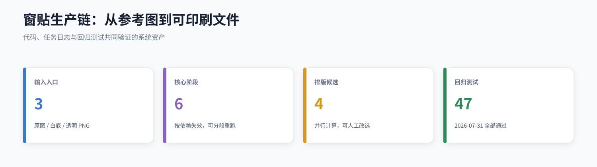
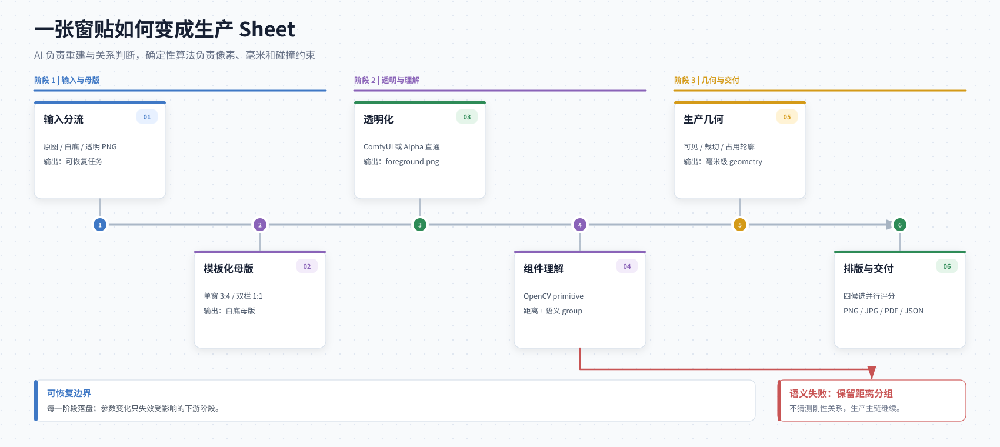
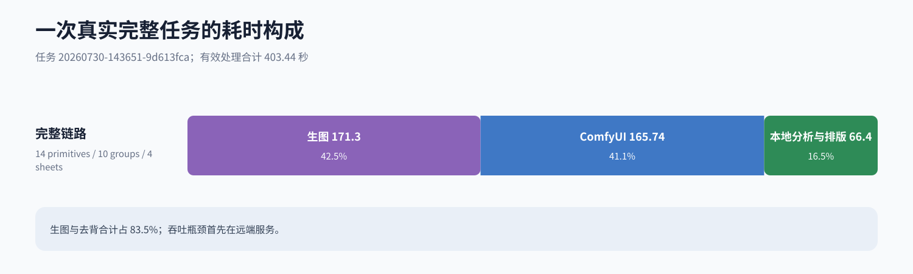
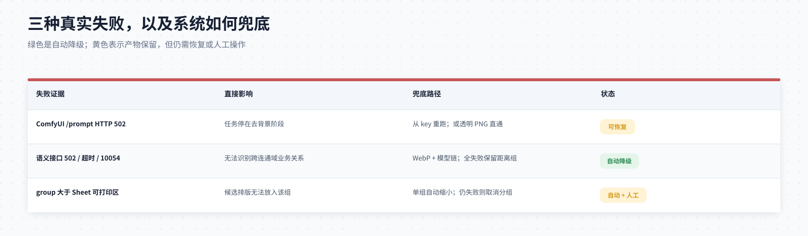

# 窗贴生成系统 · 技术资产卡


<!-- vpd-table-style:start -->
<style>
.vpd-table-wrap {
  margin: 1.15rem 0 1.5rem;
  overflow-x: auto;
  border: 1px solid #d8e0ea;
  border-radius: 10px;
  box-shadow: 0 4px 14px rgba(31, 47, 70, 0.06);
}
.vpd-table {
  width: 100%;
  border-collapse: collapse;
  border-spacing: 0;
  color: #27364a;
  font-size: 0.94rem;
  line-height: 1.55;
}
.vpd-table thead {
  background: #e3ebf5;
  color: #213f60;
  border-top: 5px solid #6486af;
}
.vpd-table th {
  padding: 0.8rem 0.9rem;
  text-align: left;
  font-weight: 650;
  border-bottom: 1px solid #cbd7e5;
  white-space: nowrap;
}
.vpd-table td {
  padding: 0.78rem 0.9rem;
  border-bottom: 1px solid #dfe6ee;
  vertical-align: top;
}
.vpd-table tbody tr:nth-child(even) {
  background: #f7f9fc;
}
.vpd-table tbody tr:last-child td {
  border-bottom: 0;
}
.vpd-table .vpd-num {
  text-align: right;
  font-variant-numeric: tabular-nums;
}
.vpd-tag {
  display: inline-block;
  padding: 0.14rem 0.52rem;
  border-radius: 999px;
  font-weight: 650;
  white-space: nowrap;
}
.vpd-tag--blue { color: #2f67b2; background: #e4eefb; }
.vpd-tag--green { color: #237a4b; background: #e4f3e9; }
.vpd-tag--amber { color: #9b6809; background: #fff1cf; }
.vpd-tag--red { color: #b33f3f; background: #fde8e8; }
.vpd-tag--purple { color: #7651aa; background: #f0e8fa; }
.vpd-table code {
  color: #36526f;
  background: #eef3f8;
  border-radius: 4px;
  padding: 0.08rem 0.3rem;
}
</style>
<!-- vpd-table-style:end -->

> 把电商参考图、白底母版或透明 PNG，转换成可追踪、可分段重跑、可排版并能交付 PNG / JPG / PDF / ZIP 的窗贴生产任务。



## 先建立一个正确的系统印象

这不是“调用一次模型，直接得到整张印刷页”。系统刻意把不稳定的 AI 能力和必须精确的生产算法分开：

- **AI 层**重建白底母版，并判断非连通元素是否存在业务关系。
- **确定性算法层**处理 Alpha、连通域、毫米换算、裁切轮廓、碰撞和 Sheet 排版。
- **任务层**保存每一步的图片、JSON、参数和日志，允许只重跑受影响的下游阶段。

默认生产 Sheet 为 **381×304.8 mm**，输出为 **300 DPI**。单窗模板默认为 450×600 mm、3:4；双栏窗模板默认为 600×600 mm、1:1。模板定义见 [`window_templates.py`](../window_templates.py)。

## 一张输入图如何变成生产 Sheet



主运行路径由 [`execute_job`](../app.py) 编排，阶段顺序来自 [`pipeline.STAGES`](../pipeline.py)：

<div class="vpd-table-wrap">
<table class="vpd-table">
  <thead>
    <tr>
      <th>阶段</th>
      <th>做什么</th>
      <th>关键输出</th>
    </tr>
  </thead>
  <tbody>
    <tr>
      <td><code>input</code></td>
      <td>接收电商原图、白底母版或透明 PNG</td>
      <td><code>uploads/</code>、任务设置</td>
    </tr>
    <tr>
      <td><code>generate</code></td>
      <td>按单窗/双栏模板生成创新白底母版</td>
      <td><code>master.png</code>、实际 Prompt、原始响应</td>
    </tr>
    <tr>
      <td><code>key</code></td>
      <td>ComfyUI 去背景，或保留上传文件 Alpha</td>
      <td><code>foreground.png</code>、<code>clean-alpha.png</code></td>
    </tr>
    <tr>
      <td><code>components</code></td>
      <td>OpenCV 连通域形成 primitive，再做距离/语义分组</td>
      <td><code>primitives.json</code>、<code>groups.json</code></td>
    </tr>
    <tr>
      <td><code>geometry</code></td>
      <td>Shapely 生成可见、裁切、占用与排样轮廓</td>
      <td><code>geometry.json</code>、<code>physical-scale.json</code></td>
    </tr>
    <tr>
      <td><code>layout</code></td>
      <td>四种策略并行排版、评分和生产渲染</td>
      <td>四候选、PNG、JPG、PDF、<code>layout.json</code></td>
    </tr>
  </tbody>
</table>
</div>

### 三种输入共用同一个生产后半段

<div class="vpd-table-wrap">
<table class="vpd-table">
  <thead>
    <tr>
      <th>输入模式</th>
      <th>跳过什么</th>
      <th>进入生产链的位置</th>
    </tr>
  </thead>
  <tbody>
    <tr>
      <td>电商原图 <code>source</code></td>
      <td>不跳过</td>
      <td>模板化生图 → ComfyUI 去背景</td>
    </tr>
    <tr>
      <td>白底母版 <code>master</code></td>
      <td>跳过生图</td>
      <td>ComfyUI 去背景</td>
    </tr>
    <tr>
      <td>透明 PNG <code>alpha</code></td>
      <td>跳过生图和去背景</td>
      <td>Alpha 标准化 → 组件分析</td>
    </tr>
  </tbody>
</table>
</div>

这里的关键产品边界是：**透明 PNG 是一等输入，不是异常绕路**。当去背服务不可用或已有高质量 Alpha 时，可以直接进入确定性算法链。

## 一条真实任务把每一步摊开来看

以下资产来自任务 `20260730-143651-9d613fca`：

- 输入模式：电商原图；
- 窗户模板：双栏窗 600×600 mm；
- 识别结果：14 个 primitive、10 个有效 group；
- 最终选择：`maxrects`；
- 生产结果：4 张 381×304.8 mm Sheet。

| 创新白底母版 | 去背景后的透明母版 | 连通域与 pXXX 编号 |
|---|---|---|
|  |  |  |

| `maxrects` 四页候选总览 | 最终白底生产页 |
|---|---|
|  |  |

### 时间主要花在哪里



<div class="vpd-table-wrap">
<table class="vpd-table">
  <thead>
    <tr>
      <th>阶段</th>
      <th class="vpd-num">耗时</th>
      <th class="vpd-num">占 403.44 秒</th>
    </tr>
  </thead>
  <tbody>
    <tr>
      <td>生图</td>
      <td class="vpd-num">171.30 s</td>
      <td class="vpd-num">42.5%</td>
    </tr>
    <tr>
      <td>ComfyUI 去背景</td>
      <td class="vpd-num">165.74 s</td>
      <td class="vpd-num">41.1%</td>
    </tr>
    <tr>
      <td>组件分析</td>
      <td class="vpd-num">33.17 s</td>
      <td class="vpd-num">8.2%</td>
    </tr>
    <tr>
      <td>几何轮廓</td>
      <td class="vpd-num">1.51 s</td>
      <td class="vpd-num">0.4%</td>
    </tr>
    <tr>
      <td>四候选排版</td>
      <td class="vpd-num">31.72 s</td>
      <td class="vpd-num">7.9%</td>
    </tr>
  </tbody>
</table>
</div>

**结论**：这条样本的吞吐瓶颈首先在远端生图与去背，不在本地 Shapely 几何。这个结论只来自一条完整样本，适合作为优化方向，不应当被当成长期 SLA。

### 四候选是四种不同的取舍

<div class="vpd-table-wrap">
<table class="vpd-table">
  <thead>
    <tr>
      <th>候选</th>
      <th>策略</th>
      <th class="vpd-num">页数</th>
      <th class="vpd-num">全局缩放</th>
      <th class="vpd-num">紧凑度</th>
      <th class="vpd-num">对齐度</th>
      <th>结果</th>
    </tr>
  </thead>
  <tbody>
    <tr>
      <td>candidate-1</td>
      <td><code>tidy_rows</code></td>
      <td class="vpd-num">3</td>
      <td class="vpd-num">92%</td>
      <td class="vpd-num">0.806</td>
      <td class="vpd-num">0.806</td>
      <td>只展示，不参与自动选择</td>
    </tr>
    <tr>
      <td>candidate-2</td>
      <td><code>maxrects</code></td>
      <td class="vpd-num">4</td>
      <td class="vpd-num">100%</td>
      <td class="vpd-num">0.833</td>
      <td class="vpd-num"><span class="vpd-tag vpd-tag--blue"><strong>0.908</strong></span></td>
      <td><span class="vpd-tag vpd-tag--green"><strong>最终选中</strong></span></td>
    </tr>
    <tr>
      <td>candidate-3</td>
      <td><code>hybrid_fill</code></td>
      <td class="vpd-num">5</td>
      <td class="vpd-num">100%</td>
      <td class="vpd-num">0.680</td>
      <td class="vpd-num">0.820</td>
      <td><span class="vpd-tag vpd-tag--amber">可人工选择</span></td>
    </tr>
    <tr>
      <td>candidate-4</td>
      <td><code>center_compact</code></td>
      <td class="vpd-num">4</td>
      <td class="vpd-num">100%</td>
      <td class="vpd-num"><span class="vpd-tag vpd-tag--blue"><strong>0.834</strong></span></td>
      <td class="vpd-num">0.533</td>
      <td><span class="vpd-tag vpd-tag--amber">可人工选择</span></td>
    </tr>
  </tbody>
</table>
</div>

该任务是 `source` 输入，代码使用综合分优先的选择规则，因此没有为了少一页而接受 92% 全局缩小。完整坐标与评分保存在 [`final/layout.json`](../runs/20260730-143651-9d613fca/final/layout.json)。

## 三个真正可复用的模块


<div class="vpd-table-wrap">
<table class="vpd-table">
  <thead>
    <tr>
      <th>模块</th>
      <th>核心职责</th>
      <th>输入</th>
      <th>输出</th>
    </tr>
  </thead>
  <tbody>
    <tr>
      <td><span class="vpd-tag vpd-tag--purple">A · 模板化母版</span></td>
      <td>主题创新、窗户结构和比例约束</td>
      <td>参考图、Prompt、模板、毫米尺寸</td>
      <td>白底母版、实际 Prompt、请求证据</td>
    </tr>
    <tr>
      <td><span class="vpd-tag vpd-tag--green">B · Alpha 与组件</span></td>
      <td>去背、连通域、距离与语义分组</td>
      <td>白底图或透明 PNG</td>
      <td><code>foreground</code>、<code>primitives</code>、<code>groups</code></td>
    </tr>
    <tr>
      <td><span class="vpd-tag vpd-tag--amber">C · 排样与交付</span></td>
      <td>毫米轮廓、候选排样和生产渲染</td>
      <td>透明组件、组关系、Sheet 规格</td>
      <td>PNG、JPG、PDF、<code>layout.json</code>、ZIP</td>
    </tr>
  </tbody>
</table>
</div>

### A · 模板化母版生成器

可复用价值不在于某一段节日 Prompt，而在于把三种约束分开保存：

1. 通用创新要求；
2. 单窗/双栏窗结构硬约束；
3. 当前任务唯一的安装毫米尺寸。

[`generation.py`](../generation.py) 根据模板选择请求尺寸。返回比例异常时，系统使用白底容纳式标准化，不拉伸图案；请求摘要、最终 Prompt 和原始响应均落盘。

### B · Alpha 与组件理解器

`primitive` 是像素上连通的最小组件；`group` 是生产排版时必须一起移动的业务单元。

两层分开后，系统既能保存最原始的像素证据，也能表达“hello”和独立感叹号这类不连通、但业务上必须保持相对关系的元素。视觉模型接收完整透明母版和 pXXX 标注图，只返回高置信刚性关系；实现位于 [`semantic_grouping.py`](../semantic_grouping.py)。

### C · 毫米级排样与交付器

[`pipeline.py`](../pipeline.py) 生成可见轮廓、裁切轮廓和排样占用轮廓，再并行运行：

- `tidy_rows`：行列整齐；
- `maxrects`：矩形空间紧凑利用；
- `hybrid_fill`：大元素 MaxRects，小元素异形填缝；
- `center_compact`：紧凑排完后整页居中。

生产安全距离使用固定毫米值：默认页边距 10 mm、裁切外扩 1.5 mm、贴纸间距 2 mm。全局缩放只缩图案，不缩安全缓冲。

## 三种真实失败，以及哪些能自动兜底



<div class="vpd-table-wrap">
<table class="vpd-table">
  <thead>
    <tr>
      <th>真实失败</th>
      <th>日志证据</th>
      <th>代码行为</th>
      <th>兜底性质</th>
    </tr>
  </thead>
  <tbody>
    <tr>
      <td><span class="vpd-tag vpd-tag--red">ComfyUI 网关 502</span></td>
      <td><span class="vpd-tag vpd-tag--red"><code>20260730-104948-f01df750</code>：<code>/prompt HTTP 502</code></span></td>
      <td>任务停在去背景阶段并保存状态</td>
      <td><span class="vpd-tag vpd-tag--amber">可恢复，但不是自动换服务</span></td>
    </tr>
    <tr>
      <td><span class="vpd-tag vpd-tag--red">语义接口 502 / 写超时 / 10054</span></td>
      <td><span class="vpd-tag vpd-tag--red"><code>20260729-193043-06645399</code> 多次上游失败</span></td>
      <td><span class="vpd-tag vpd-tag--red">WebP 压缩、模型链、两轮重试；全失败保留距离分组</span></td>
      <td>自动降级，生产主链继续</td>
    </tr>
    <tr>
      <td>group 大于 Sheet 可打印区</td>
      <td><span class="vpd-tag vpd-tag--red"><code>20260730-143651-9d613fca</code>：<code>g009</code> 两次失败</span></td>
      <td><span class="vpd-tag vpd-tag--red">先只缩小该超大组；仍失败才报出 group id</span></td>
      <td><span class="vpd-tag vpd-tag--amber">自动尝试，必要时人工取消分组</span></td>
    </tr>
  </tbody>
</table>
</div>

### 失败一：ComfyUI 不可用

[`remove_background`](../comfyui_client.py) 会提交工作流、轮询 history、下载图片并校验 Alpha。`/prompt` 返回 502 时，当前实现不会自动切换另一家去背服务。

可用恢复路径有两条：

- 服务恢复后从 `key` 阶段重跑，不必重新生图；
- 如果已有透明 PNG，改走 Alpha 直通链路，完全绕过 ComfyUI。

### 失败二：视觉语义模型不可用

语义分组是增强层，不是生产链的单点：

- 两张输入图先缩放并压缩为 WebP，再编码成 Base64 data URL；
- 模型链按 `sol → luna → terra → 4o` 执行；
- 默认执行两轮，连接/写入超时被放宽；
- 全部失败后，主任务记录错误并保留确定性的距离分组。

因此这里的兜底是“少做一次语义合并”，而不是伪造模型结果。

### 失败三：刚性组比可打印区域还大

排版器先尝试只缩小这一组，裁切外扩和贴纸间距仍保持固定毫米值。如果仍然放不下，错误会明确列出 group id，要求减小安装尺寸或撤销错误分组。该行为由 `test_oversized_group_is_auto_shrunk_to_fit` 覆盖。

## 每个任务留下怎样的数据资产

系统的真正资产不是某一张结果图，而是从输入到交付的可审计数据脊柱：

```text
runs/<job-id>/
├─ uploads/                  # 原始输入
├─ generate/                 # 白底母版、Prompt、请求与响应
├─ comfyui/ + key/           # 去背证据与规范透明母版
├─ components/               # primitives、groups、标注与语义关系
├─ geometry/                 # 轮廓与毫米换算
├─ layout/candidate-1..4/    # 四套可复现候选
├─ final/
│  ├─ transparent/           # 300 DPI 透明 Sheet PNG
│  ├─ white/                 # 300 DPI 白底 Sheet JPG
│  ├─ pdf/                   # 单页与多页 PDF
│  └─ layout.json            # 生产坐标和文件清单
└─ job.json                  # 状态、参数、日志和资产索引
```

`job.json` 通过唯一临时文件、原子替换和 PermissionError 重试保存，解决 Windows 下并发写入或短暂占用导致的固定 `.tmp` 文件失败。

## 哪些结论已验证，哪些仍是边界

<div class="vpd-table-wrap">
<table class="vpd-table">
  <thead>
    <tr>
      <th>证据级别</th>
      <th>结论</th>
    </tr>
  </thead>
  <tbody>
    <tr>
      <td><span class="vpd-tag vpd-tag--green"><strong>已验证</strong></span></td>
      <td>三种输入、模板化生图、ComfyUI 去背、Alpha 直通、组件/分组、轮廓、四候选和 PNG/JPG/PDF/ZIP 均有可执行代码与测试</td>
    </tr>
    <tr>
      <td><span class="vpd-tag vpd-tag--green"><strong>已验证</strong></span></td>
      <td><span class="vpd-tag vpd-tag--green">2026-07-31 使用项目环境运行 <code>pytest -q</code>，47 项测试全部通过</span></td>
    </tr>
    <tr>
      <td><span class="vpd-tag vpd-tag--amber"><strong>基于结构的推断</strong></span></td>
      <td>三个模块已有清晰的文件和 JSON 边界，具备继续拆成内部服务或 Python package 的条件</td>
    </tr>
    <tr>
      <td><span class="vpd-tag vpd-tag--red"><strong>尚未实现</strong></span></td>
      <td>CMYK/ICC、白墨专色、刀机专用格式、印厂拼版标准</td>
    </tr>
    <tr>
      <td><span class="vpd-tag vpd-tag--red"><strong>尚未实现</strong></span></td>
      <td>工业级 NFP 异形嵌套；当前使用 MaxRects、轮廓碰撞和启发式压实</td>
    </tr>
    <tr>
      <td><span class="vpd-tag vpd-tag--red"><strong>尚未实现</strong></span></td>
      <td>生图与 ComfyUI 的第二供应商自动切换</td>
    </tr>
  </tbody>
</table>
</div>

## 从哪里开始读代码

<div class="vpd-table-wrap">
<table class="vpd-table">
  <thead>
    <tr>
      <th>想理解的问题</th>
      <th>入口</th>
    </tr>
  </thead>
  <tbody>
    <tr>
      <td>任务如何分阶段运行与恢复</td>
      <td><a href="../app.py"><code>app.py · execute_job</code></a></td>
    </tr>
    <tr>
      <td>单窗/双栏窗比例如何定义</td>
      <td><a href="../window_templates.py"><code>window_templates.py</code></a></td>
    </tr>
    <tr>
      <td>白底母版如何生成与标准化</td>
      <td><a href="../generation.py"><code>generation.py · generate_master</code></a></td>
    </tr>
    <tr>
      <td>七牛云 URL 如何进入 ComfyUI</td>
      <td><a href="../comfyui_client.py"><code>comfyui_client.py · remove_background</code></a></td>
    </tr>
    <tr>
      <td>语义模型如何接收两张图并降级</td>
      <td><a href="../semantic_grouping.py"><code>semantic_grouping.py</code></a></td>
    </tr>
    <tr>
      <td>组件、几何、排版与生产文件</td>
      <td><a href="../pipeline.py"><code>pipeline.py</code></a></td>
    </tr>
    <tr>
      <td>行为边界如何被测试锁定</td>
      <td><a href="../tests/"><code>tests/</code></a></td>
    </tr>
  </tbody>
</table>
</div>

验证命令：

```powershell
C:\Users\melonedoe\miniconda3\python.exe -m pytest -q
```

## 下一步

若这份资产卡用于技术评审，下一步应把 **远端生图/去背成功率与 P50/P95 耗时**纳入批量任务统计。当前单条任务已经说明远端阶段可能占大部分时间，但样本量不足以支撑容量规划。

---

<sub>资产卡重写日期：2026-07-31。技术事实来自当前代码、测试和本地任务日志；远端接口与模型可用性会随运行环境变化。</sub>
